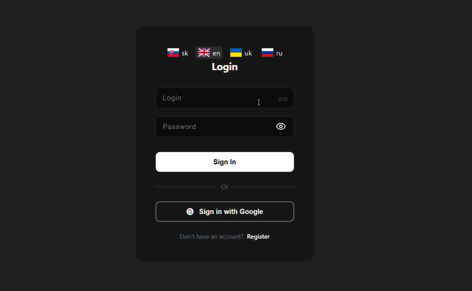
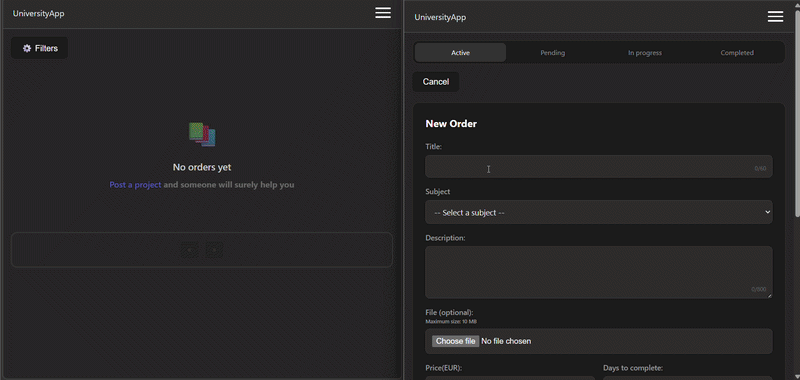
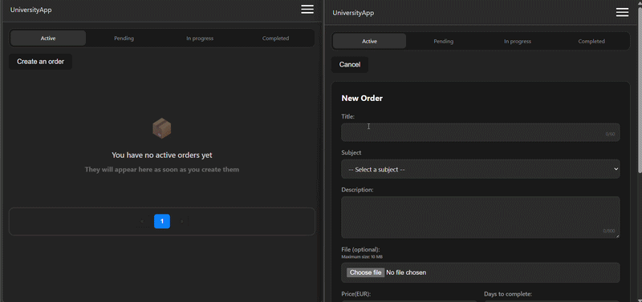
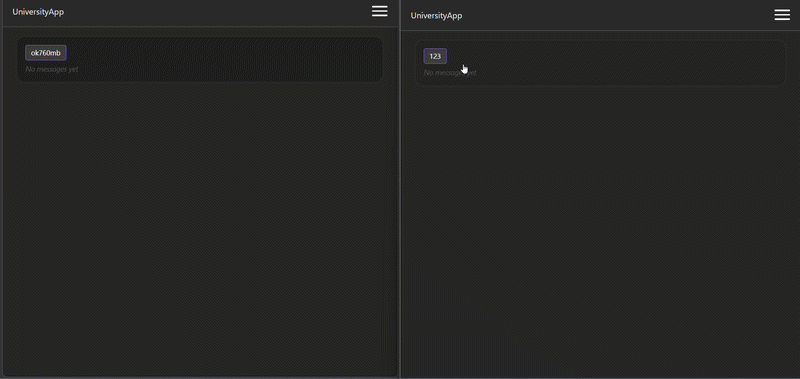

# ✍🏻 Lcoin — Fullstack Academic Infrastructure

Lcoin is a high-performance management system for university students, designed to manage assignments and communication through a secure, containerized environment.

---

## 🚀 Tech Stack

### Backend & API
* **Framework:** Django 5.x & Django REST Framework (DRF)
* **Database:** PostgreSQL
* **Auth:** JWT (SimpleJWT) & Google OAuth2 (`django-allauth`)
* **Static Handling:** WhiteNoise & Nginx

### Frontend
* **Core:** React.js (Powered by Vite)
* **UI/UX:** **Native Dark-Only Theme** 
* **Styling:** **CSS Modules** (Scoped & modular styling for clean JSX)

### Infrastructure & Security
* **Containerization:** Docker & Docker Compose
* **Web Server:** Nginx (Reverse Proxy & SSL termination)
* **Networking:** Cloudflare SSL (Full Strict mode)
* **Configuration:** Environment-based settings (`django-environ`)

---

## 🏗 System Architecture

The project follows a microservice-ready pattern:
1. **Frontend:** React SPA serving a sleek, high-contrast interface.
2. **Backend:** Django API managing business logic and PostgreSQL ORM.
3. **Nginx:** The entry point for all traffic, handling SSL and static/media routing.

---


## 📽 Feature Demos

### 1. Seamless Onboarding
**Google OAuth2 Integration** Lcoin allows students to skip tedious forms and authenticate instantly using their university Google accounts. This process handles user creation and JWT issuance automatically.


---

### 2. Smart Bidding & Marketplace
**Task Management with Real-time Updates** The core of Lcoin is its task marketplace. Watch how a user creates a task, and another user instantly places a bid from a different account. 
* **Action:** Create task -> Switch Account -> Place Bid.


---

### 3. Conflict Resolution & Error Handling
**Robust Backend Validation** Lcoin is built for a multi-device world. If a user tries to interact with a task that was already deleted or modified from another session, the system provides clear, non-blocking feedback.
* **Scenario:** Attempting to delete/edit an already removed item.


---

### 4. API-Powered Communication
**Cross-User Messaging** Our messaging engine ensures that students can stay in touch. Even though it's driven by a REST API, the interaction is smooth and reliable across different browser sessions.
* **Flow:** Sending messages between User A and User B in real-time.


---

## 🛡 Security & Repository Integrity

* **SSL Certificates:** In this repository, `.key` and `.pem` files are replaced with **security placeholders**. Production keys are managed via Cloudflare and mounted as secure Docker volumes.
* **Secrets:** All API keys and Database credentials are kept in `.env` (excluded from Git).
* **JWT:** Stateless authentication with secure access/refresh token rotation.

---

## 🛠 Installation

1. Clone & Setup Environment
  ```bash
    git clone https://github.com/myfish-code/Lcoin/
    cd Lcoin
  ```

2. Launch Infrastructure (Containers)
  ```bash
    docker-compose up --build -d
  ```

3. Database Initialization
  ```bash
    docker-compose exec backend python manage.py migrate
    docker-compose exec backend python manage.py createsuperuser
  ```

4. Frontend Production Build
  ```bash
    docker-compose run --rm frontend npm run build
  ```

5. Static Files Collection
  ```bash
    docker-compose exec backend python manage.py collectstatic --no-input
  ```
